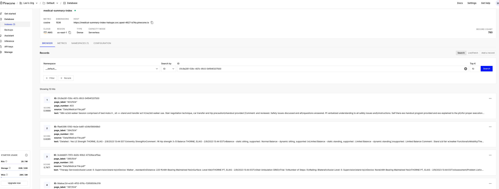

# Medical Summary Builder

Medical Summary Builder is an end-to-end pipeline that ingests medical disability case files, extracts key information using a Retrieval-Augmented Generation (RAG) agent, and produces a structured medical summary in the format of a user-provided template.

The system is designed for reliability and flexibility, featuring robust parsing logic, a fallback extraction mechanism, and support for custom, user-defined data tables.

---

## Key Capabilities

- **Automated Ingestion**: Seamlessly processes multi-page medical PDFs and DOCX summary templates.
- **RAG-Powered Extraction**: Employs a ReAct agent that iteratively queries a vector knowledge base to find and extract claimant data, medical events, and other key facts.
- **Robust Parsing & Fallback**: Features sophisticated logic to parse structured JSON from agent output and includes a fallback mechanism that performs direct LLM extraction if the agent fails, ensuring high reliability.
- **Customizable Reporting**: Supports user-provided instructions (via markdown) to generate custom tables alongside the standard medical timeline, catering to specific analytical needs.
- **Dual Interfaces**: Offers both a command-line interface (CLI) for local and batch processing, and a RESTful API (built with FastAPI) for seamless integration into other systems.
- **Flexible Reporting**: Generates final summaries in both DOCX (populating the original template) and Markdown formats.

---

## Project Achievements

This project successfully delivers a robust, end-to-end solution for automated medical summary generation. Key achievements include:

- **Fully Automated Pipeline**: An operational workflow that seamlessly ingests a source PDF and DOCX template, orchestrates LLM-driven data extraction, and generates a populated summary report without manual intervention.
- **Advanced RAG-Agent Implementation**: Successful integration of a ReAct agent that iteratively queries a Pinecone vector store to gather evidence, demonstrating a sophisticated approach to information retrieval.
- **High-Reliability Extraction**: A dual-layer extraction strategy combining a primary ReAct agent with a schema-guided fallback mechanism. This design ensures that the pipeline can recover from agent failures and still produce structured output.
- **Dynamic & Customizable Table Generation**: The system directly addresses the bonus objective by allowing users, such as attorneys, to define their own table structures using plain-text markdown instructions. It can generate reports with custom layouts (e.g., 5 columns for Data, Facility, Physician, Summary, and Ref) based on these instructions. While further system prompt optimization can enhance control, the core mechanism to support this advanced flexibility is already implemented.
- **Production-Ready Interfaces**: Delivers both a powerful command-line interface (CLI) for batch processing and a scalable FastAPI web service for real-time integration, making the tool versatile for different deployment scenarios.
- **Modular and Maintainable Codebase**: The project is built on a clean, modular architecture, with clear separation of concerns (e.g., ingestion, processing, reporting). This structure makes the system easy to understand, maintain, and extend.

---

## How It Works: The Extraction Pipeline

1.  **Ingestion & Preprocessing**: The pipeline begins by loading the source `Medical File.pdf` and the `Medical Summary.docx` template. The PDF content is parsed and split into manageable, overlapping text chunks (default size: 1500 chars, overlap: 200 chars) to prepare for indexing.
2.  **Vector Indexing**: Each text chunk is converted into a vector embedding using a powerful model (e.g., `Qwen/Qwen3-Embedding-8B` or `text-embedding-3-small`) and stored in a Pinecone index. This creates a searchable knowledge base from the medical record. This step can be skipped on subsequent runs if the index is already populated.

    [](outputs/pinecone_index.png)
3.  **Agent-Driven Extraction**: A ReAct (Reasoning and Acting) agent, powered by a large language model (default: `Qwen/Qwen3-235B-A22B-Thinking-2507` for Nebius; default: `gpt-5-nano` for OpenAI), is tasked with building the summary. It uses a retriever tool to query the vector index iteratively, gathering evidence to populate the claimant's profile (name, SSN, DOB, etc.) and construct a timeline of medical events.
4.  **Structured Data Parsing**: The agent is prompted to return its findings as a structured JSON object. The pipeline contains robust logic to find and parse this JSON, even if it is embedded in conversational text or slightly malformed.
5.  **Fallback Extraction**: If the primary agent fails to return a valid structured output, a fallback mechanism is triggered. This process retrieves a broad context from the vector store and uses a direct, schema-guided LLM call to extract the required information, preventing pipeline failure.
6.  **Report Generation**: The final structured data, represented by a `MedicalSummary` Pydantic model, is passed to a `ReportWriter`. This component populates the original DOCX template with the extracted data and also generates a clean Markdown version of the summary.

---

## Repository Layout

```
.
├── Data/
│   ├── Medical File.pdf
│   └── Medical Summary.docx
├── outputs/
│   └── .gitkeep
├── prompts/
│   └── custom_table.md
├── requirements.txt
└── src/
    └── medical_summary_builder/
        ├── __init__.py
        ├── agents/         # ReAct agent creation
        ├── api/            # FastAPI application
        ├── cli.py          # Typer CLI entrypoint
        ├── config.py       # Centralized configuration
        ├── data_ingestion/ # PDF and DOCX loaders
        ├── llm/            # LLM client and embedding factories
        ├── logging_config.py # Logging setup
        ├── pipelines/      # Core orchestration logic
        ├── preprocessing/  # Document chunking and analysis
        ├── reporting/      # DOCX and Markdown report writers
        ├── schemas/        # Pydantic data models
        ├── services/       # High-level service facades
        └── utils/          # Shared utilities
```

---

## Getting Started

### Prerequisites

- Python 3.11+
- API keys for your chosen LLM provider(s) (e.g., OpenAI, Nebius) and Pinecone.

### Installation

1.  **Clone the repository and create a virtual environment:**
    ```bash
    git clone <repository_url>
    cd <repository_name>
    python -m venv .venv
    source .venv/bin/activate  # On Windows: .venv\Scripts\activate
    ```

2.  **Install the required dependencies:**
    ```bash
    pip install -r requirements.txt
    ```

3.  **Install the package in editable mode** to make the CLI available:
    ```bash
    pip install -e .
    ```

### Configuration

Create a `.env` file in the project root and add your API keys and Pinecone configuration. See `src/medical_summary_builder/config.py` for all available options.

```dotenv
# .env - API Keys and Configuration
OPENAI_API_KEY="sk-..."
NEBIUS_API_KEY="..."

# Pinecone Vector Store
PINECONE_API_KEY="..."
PINECONE_INDEX="medical-summary-index"
```

---

## Usage

### Command-Line Interface (CLI)

Run the summary generation process from the project root. The following command uses the sample data and skips re-indexing an existing vector store. A video demonstration is available: [CLI Demo](outputs/demp.mp4).

```bash
python -m medical_summary_builder.cli \
  --pdf-path "Data/Medical File.pdf" \
  --template-path "Data/Medical Summary.docx" \
  --custom-instruction-file "prompts/custom_table.md" \
  --skip-indexing
```

**Key Flags:**
- `--custom-instruction-file`: Optional path to a markdown file describing custom table structures.
- `--skip-reports`: Prevents writing DOCX and Markdown files (useful if you only need the JSON output).
- `--skip-indexing`: Bypasses the PDF chunking and vector indexing steps, assuming the knowledge base is already populated.

Outputs are saved to the `outputs/reports/` directory by default.

### FastAPI Service

Start the web service using Uvicorn:

```bash
uvicorn medical_summary_builder.api.app:create_app --factory --reload
```

The API will be available at `http://127.0.0.1:8000`. You can interact with it via the auto-generated OpenAPI documentation at `http://127.0.0.1:8000/docs`. The primary endpoint is `POST /summaries`, which accepts multipart form data.

---

## Future Improvements & To-Do

- [ ] **Hybrid Search Implementation**: Enhance retrieval accuracy by integrating TF-IDF/BM25 sparse vectors with dense embeddings for Pinecone hybrid search.
- [ ] **Advanced Page Relevance Ranking**: Implement a sliding window (3-page context) to allow an LLM to evaluate page relevance against user instructions, filtering out irrelevant pages before detailed extraction.
- [ ] **Intelligent Metadata & Content Summarization**: Use an LLM to identify and extract key claimant metadata from the source file, and summarize dense sections to create a more concise context for the agent.
- [ ] **Contiguous Page Processing**: Group sequentially relevant pages and process them as a single context to improve the LLM's ability to fill tables accurately.
- [ ] **Enhanced Data Post-processing**: Implement automatic chronological sorting for all generated timelines and tables after extraction.
- [ ] **Expanded Nebius Model Support**: Improve compatibility with Nebius chat models, including custom adjustments for their structured output and tool-use schemas.
- [ ] **Refined Indexing Metadata**: Enhance the document chunking and indexing process to include more robust and accurate page reference metadata.
- [ ] **Data Augmentation for Chunk Quality**: Investigate techniques to augment source data to create higher-quality, more context-aware chunks for vector embedding.
- [ ] **Dynamic Layout Builder**: Extend the `ReportWriter` to dynamically generate DOCX tables from user-defined schemas.
- [ ] **Evaluation Harness**: Develop a suite of tests to compare generated summaries against ground-truth samples for quantitative quality assessment.
- [ ] **Add Unit Tests**: Scaffold a `tests/` directory and implement a comprehensive suite of unit tests with `pytest`.
